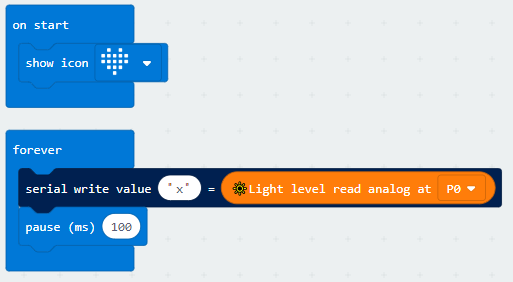
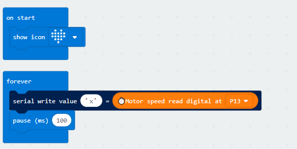
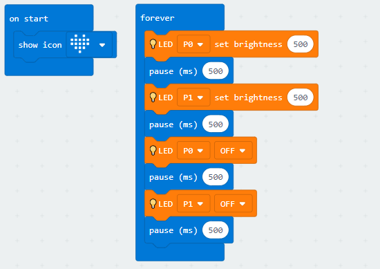
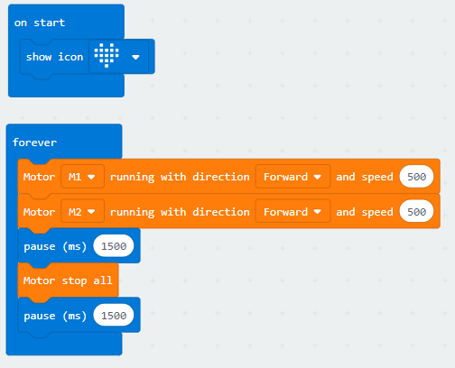

# Magibit Library for Micro:bit
version: v0.1.2

http://docs.imagimaker.com/

Micro:Bit Package for Magibit hardware series. The package is used with Magishield/Magibit microcontroller and sensor series. It could work without Magishield, people should use a adapter (4pin grove <-> alligator clip) to connect the sensor and Micro:Bit

该扩展包为麦极创客专门为Micro:bit开发的语句库。推荐配合麦极创客的Magishield扩展板、Magibit主板和Magibit传感器套装进行使用，以便获得最好的体验。同时该包也支持市面上绝大多数的Micro:bit传感器模块和执行器，用户自行进行pin口连接即可。

## 1. 当前版本支持的模块, Sensor/Module
- 光线传感器, Magi Light Sensor
- 声音传感器, Magi Sound Sensor
- 土壤湿度传感器, Magi Soil Humidity Sensor
- 巡线红外传感器, Magi Line Finder Sensor
- 测速模块, Magi Motor Speed Sensor (infrared interrupter)
- 空气温湿度传感器, Magi Air Tempreture/Humidity Sensor
- 超声波传感器, Magi Ultrasonic Sensor
- 摇杆, Magi Joystick Module
- 电位器, Magi Potentiometer Module
- 电机, DC Motor
- LED, Magi LED Module

## 2. Instruction and Basic Usage

#### 2.1 How to add the package
- Advanced->add package(点击高级->添加软件包), copy Magibit url: https://github.com/Imagimaker/pxt-magibit
- Click the package

#### 2.2 Basic Usage

2.2.1.  Light Sensor/Air Tem&Humidity/Sound/Soil Humidity/Ultrasonic Sensor
- Plug the Magi light sensor into Magishield A2 port (P0, P1)
- Put blocks like the pic below and click Download, it would show the light analog value in a serial tool.

2.2.2. Infrared Line Finder/Moter Speed (Infrared Interrupter)

- Plug the Magi infrared motor speed sensor into Magishield D2 port (P13, P16)
- Put blocks like the pic below and click Download, and open a serial tool.
- Put a coin between the interrupter, you would get a "0". Otherwise, it would be "1"

2.2.3. LED Module

- Plug the Magi LED Module into Magishield A2 port (P0, P1)
- Put blocks like the pic below and click Download, you can see the LED flash from red to purple then blue.

2.2.4. DC Motor

- Plug the DC motor into Magishield M1 or M2 port
- Put blocks like the pic below and click Download
- Plug the battery into Magishield, and open the switch.
- You can see the motor start to turn.

## 3. Notes

- If you want to control servo, we recommend you use official block，Advanced->PINS->servo write pin xx to xx.
- If you want to use RGB strip, we recommend you use [NeoPixel](https://github.com/Microsoft/pxt-neopixel) package.

## Supported targets

* for PXT/microbit
